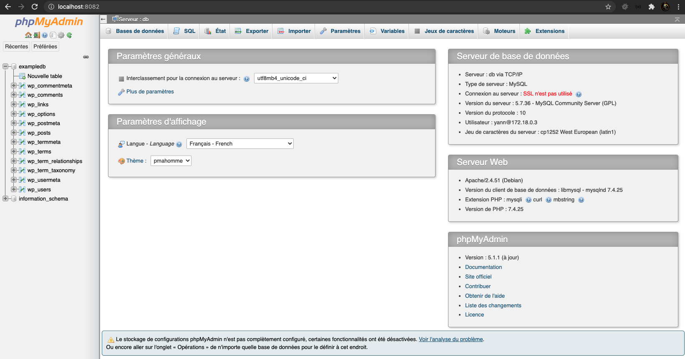
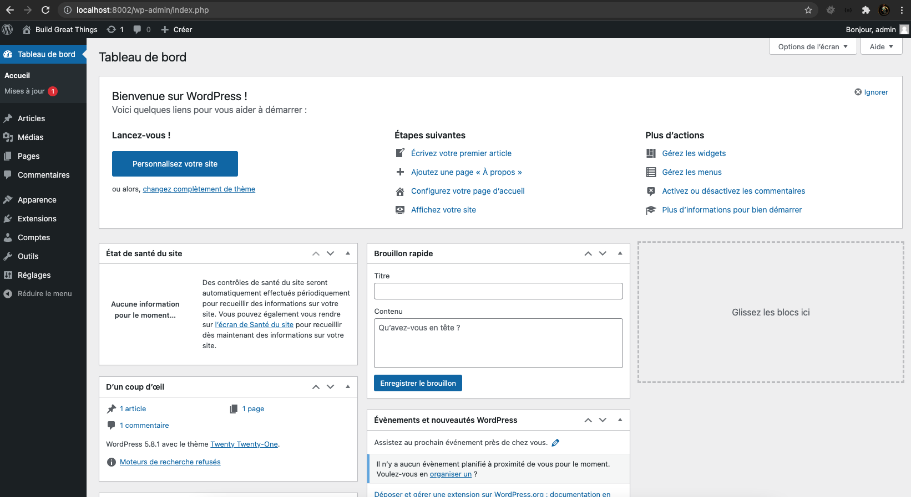

# Wordpress / Docker environment for local development

## Installation

```bash
git clone git@github.com:yannlr37/example-wordpress-docker.git appname
cd appname
docker compose up
```

## PhpMyAdmin

Go to **localhost:8082** (depending on ports you've set) and enjoy :wink:



## Website

Just go to **localhost:8002** (depding on ports you've set) and follow the installation instructions.

Then, enjoy :wink:



## Additional config for Linux

* Change /etc/hosts file : add <project>.local
* Change .docker/wordpress/Dockerfile : "ServerName" value to match previous one
* Site will be available to **<project>.local**
